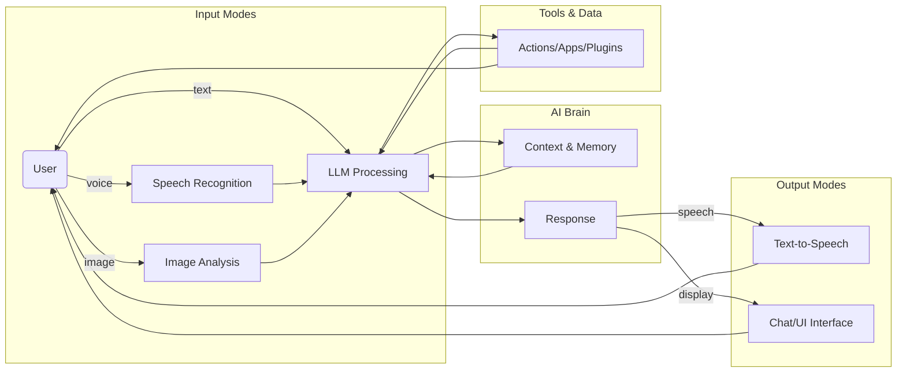
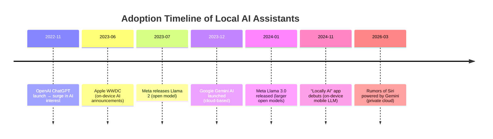

# User-Requested Features for a Private On-Device Assistant

**Executive Summary:** Users overwhelmingly want a truly **private, on-device AI assistant** that never sends their data to the cloud, yet still offers rich functionality like current assistants (Gemini/Siri).  In community discussions (Reddit, Hacker News, etc.), top requests include *persistent memory*, *local context handling*, *fast on-device inference*, *multimodal I/O (voice/text/images)*, and *deep integration* with personal data (calendar, email, files) while preserving privacy【4†L177-L184】【52†L1043-L1050】.  Key design factors are **privacy/security**, **offline capability**, **model size vs performance**, **latency and battery use**, **multimodality (speech, text, vision)**, **personalization/memory**, **tool/app integration**, **UI/UX style (conversational vs UI)**, **proactive assistance (scheduling/reminders)**, **customization/developer extensibility**, **cost (free/offline)**, and **accessibility**.  Users also note practical constraints like device OS versions, available hardware (NPUs/GPU), and language preferences. 

- **Privacy & Security:**  Most users insist “**100% private & offline**” operation (no data leaving device)【16†L100-L103】.  Offline speech-to-text/transcription is highly valued for confidential use【14†L111-L118】.  Wake-word activation (rather than always-listening) and on-device encryption are also common user concerns to protect others’ privacy【26†L43-L52】.  
- **Offline Capability:**  Running entirely without internet is a top demand.  For example, one Android user built an offline speech assistant to avoid cloud dependencies【14†L111-L118】【10†L95-L103】.  Users note that on-device models yield **low latency and fast responses**, even in air‑plane mode【14†L111-L118】【16†L100-L103】.  
- **Performance & Model Size:**  Devices vary widely in compute power. Users want options (small, efficient models up to larger ones on powerful hardware).  Many cite hardware limits: an on‑device model must run on a typical phone or PC (e.g. “**integrated graphics + 8–16 GB RAM**”), otherwise only a niche audience can use it【14†L198-L206】.  Efficiency (low CPU/GPU use) and battery impact are critical, especially on phones【10†L99-L102】.  
- **Multimodal I/O:**  A rich assistant supports **voice**, **text**, **images**, etc.  Users expect speech recognition (STT) and neural TTS on device (e.g. local Whisper or Pico/Glados TTS)【19†L114-L123】, as well as camera/image understanding (vision input).  For example, Apple’s new “Locally AI” app touts on-device chat with text and vision (“*analyze images, or generate text*” in [28]【28†L71-L75】).  A useful assistant should handle spoken queries or typed/text inputs interchangeably.  
- **Persistent Memory & Personalization:**  “Memory” is a **highly demanded feature**.  Users want the assistant to remember past interactions, user preferences and corrections **across sessions**【4†L177-L184】.  A commenter put it bluntly: *“Memory that actually accepts corrections is the one thing that turns a chatbot into something you keep coming back to”*【4†L177-L184】.  This implies on-device storage of personal context (notes, user profile, past tasks), with controls to forget or secure it.  
- **Local Data & App Integration:**  Users expect deep integration with **personal data and apps** while offline.  Key examples include calendar, email, documents, contacts and file system.  One user built a local assistant with read-only access to Gmail, Google Calendar, and Google Tasks to manage their schedule【52†L1043-L1050】.  Another asked for access to *all* communication accounts (emails, Slack) so the assistant can flag important messages【52†L1059-L1061】.  Similarly, integration with local apps (notes, reminders, browser tabs) is cited.  An on-device extension, *NativeMind*, was praised for working “across tabs” to summarize web content, translate, or answer questions using user’s open pages【24†L26-L32】.  Official assistants (Gemini/Siri) show the expected use-cases: setting calendar events, drafting emails, finding directions, etc.【12†L133-L142】【12†L241-L250】.  In a private assistant, these would run locally on one’s own data.  
- **Tools, Automation & Proactive Behaviors:**  Users value automations and “agent” capabilities.  People want a personal assistant that can **run local tools or scripts**, control smart home devices, create workflows or scheduled tasks (e.g. “*check X daily, remind me*” or routine triggering)【4†L177-L184】.  For example, a “Jarvis” Linux assistant uses hybrid intent parsing and can execute system commands securely【19†L128-L137】.  Communities suggest proactive reminders (based on calendar or location), summarizing incoming messages, or even simple task automation offline.  However, always-on listening raises new privacy risks (any voice heard could be logged【26†L49-L58】), so users emphasize clear controls (wake words, per-device memory scoping) for proactive modes.  

- **UI/UX and Interaction Modes:**  Preferred UIs range from **conversational chat interfaces** to lightweight voice dialogs.  Some built desktop overlay assistants with visual feedback (e.g. Jarvis’s GNOME panel)【19†L124-L132】, others use mobile app chat UIs.  Key is *seamless interaction*: handoff between voice and text (“type to Siri” on lock screen【32†L33-L41】), and support for any device (phone, tablet, laptop).  Users also seek friendly responsiveness (swift replies, human-like tone) without sounding robotic.  Accessibility is a factor: voice-only interaction must work reliably (especially for wearables like Apple Watch), as some complain “Siri is painfully slow or offline-dependent for simple tasks”【36†L103-L112】.  

- **Customization & Developer Extensibility:**  Enthusiast users love tinkering.  Open or plugin architectures are often requested: e.g. ability to add custom “skills” or actions via Python/Pipes (as Jarvis does【19†L136-L140】), or to choose/roll out different LLM backends.  Providing API hooks or shortcuts (like iOS Shortcuts integration【40†L92-L100】) is a plus.  However, users note that overly complex developer features can hurt simplicity.  Balancing ease-of-use with power-user flexibility is key.  

- **Cost & Accessibility:**  Free or one-time-cost deployment is important: users explicitly prefer **no subscriptions or cloud fees** (offline equals “no subscription, no API keys”【14†L111-L118】【28†L67-L75】).  Accessibility extends to wide OS support (major versions of Android/iOS/Linux/Windows) and language coverage; while many discussions are English-centric, assistants should ideally handle multiple languages and locales.  

**Top 10 Requested Features (ranked by frequency/impact):**  Based on community evidence, we identify the following priority features. For each, we give user demand quotes, rationale, implementation notes, feasibility, privacy impacts, and potential UX patterns.

1. **On-Device Privacy & Offline Mode.** *User Demand:* “100% offline… everything stays local”【16†L100-L103】.  Users repeatedly demand that *“zero data leaves your phone”*【14†L111-L118】.  **Why:** Privacy-conscious users want to avoid cloud exposure of personal data.  **Implementation:** Use fully local LLM inference (quantized models, on-device NN acceleration) and local STT/TTS; no network calls unless opt-in (even initial model download should ideally be via peer or secure channel).  On-device frameworks (e.g. Apple MLX, Qualcomm NPU) can help.  **Feasibility:** Already demonstrated by apps like Locally AI【28†L67-L75】 and ZentithLLM【16†L100-L103】.  Model size may need compromise for very limited hardware.  **Privacy:** Maximized, since no user content is logged externally.  **UX Pattern:** User can ask queries offline; UI should clearly indicate “private/local mode”.  A welcome screen could explain “Working offline – your data is private.”  
   
2. **Persistent Memory & Personalization.** *User Demand:* “Memory that actually accepts corrections… kills whole point of ‘personal’ assistant”【4†L177-L184】.  **Why:** Without memory, each session feels isolated; users have to re-explain context.  Long-term memory (names, preferences, past tasks) makes the assistant more helpful and personal.  **Implementation:** On-device storage of chat history, user profiles, bookmarks or notes.  Ideally with user control (e.g. “forget this reminder”) and strong encryption.  Could use vector databases or on-device embedding stores for recall.  **Feasibility:** Technically doable with current mobile storage; challenge is indexing and retrieval speed.  **Privacy:** On-device memory is private by design, but users may worry if data is accessible by others on the device. Provide secure lock or voiceprint unlocking for sensitive memories【19†L134-L138】.  **UX:** Assistant proactively recalls info (“Last week you said…”) and lets user correct/augment memory. UI could allow tagging or reviewing stored memories.  
   
3. **Tool & App Integration.** *User Demand:* Locally-run assistants should access *“email, calendar, and files”*【51†L73-L81】【52†L1043-L1050】.  Users built assistants linked to their Gmail/Calendar to, e.g., recommend tasks from their schedule【51†L31-L39】.  **Why:** Personal assistant is most useful when it can act on real data: e.g., read your email drafts, add calendar events, fetch a note, or control smart home devices.  **Implementation:** Provide secure, local API hooks or permissions to read/write user data (e.g. a sandbox reading specific folders or using OS-provided APIs for calendar/contacts).  Similarly, integrate web content: our teammate’s browser assistant could use tab text as input【24†L26-L32】.  **Feasibility:** On modern OS, some data is locked (iOS health or mail); workarounds include manual data import or local connectors.  Focus on commonly open platforms (e.g. Gmail via OAuth locally).  **Privacy:** Extremely high-sensitivity: make clear which data is accessed and allow per-service opt-in. If on-device only, it’s still private, but user consent is key.  **UX:** Conversational queries like “What’s on my schedule?” or “Summarize last week’s emails.”  Responses should cite sources (“I saw this in your Gmail”【52†L1043-L1050】).  Integrations also allow action commands (“Set meeting with Alice next Monday” → adds calendar event).  
   
4. **Voice + Text Multimodal I/O.** *User Demand:* Support **speech** and **text** interchangeably.  One user integrated Siri to trigger their local LLM via shortcuts【40†L95-L104】 (“Using Siri to talk to a local LLM”).  Gemini and Locally AI highlight both chat and vision: e.g. *“Ask complex questions, analyze images”*【28†L71-L75】.  **Why:** Different contexts call for different modes (hands-free driving vs typing quietly).  **Implementation:** On-device ASR (e.g. Whisper, Vosk) and TTS (e.g. Pico, WaveNet on NPU) plus a text chat interface.  Camera/image pipeline for e.g. OCR or scene recognition (Apple’s Vision framework or MLX).  **Feasibility:** Many on-device STT/TTS tech exist (iOS does offline dictation up to some model size【35†L118-L127】). Vision is heavier but smaller models (MobileNet/YOLO) can run on phone NPU.  **Privacy:** On-device pipeline means no voice or photo leaves device, which users specifically demanded【19†L130-L138】.  **UX:** The UI should offer a microphone button or “Hey Assistant” wake, plus a text field. For images, allow attaching photos. The assistant might say: “I can process this image” or “I’m now listening.”  Visual feedback or transcripts can help (especially if loud TTS can be turned off in office).  

5. **Low Latency, High Performance (Efficient Inference).** *User Demand:* “Fighting Android LMK to keep [model] alive… If it needs 24GB VRAM… it’s a niche market”【10†L99-L102】【14†L198-L206】.  **Why:** An assistant must respond quickly to avoid frustration; heavy models or slow connections kill usability.  **Implementation:** Use optimized, quantized models (e.g. 4-bit/8-bit) and specialized hardware (NPUs, GPUs). Allow choosing smaller models for low-power devices. Preload common knowledge (e.g. local FAQ) to skip inference where possible. **Feasibility:** Already happening: Locally AI uses Apple MLX to run Gemma 4 on-device with good speed【28†L93-L100】.  **Privacy:** Because everything is local, performance optimizations don’t compromise privacy. **UX:** Fast “instant answers” gives confidence. A loading indicator (if any) should be minimal. For heavier tasks (image analysis), consider background processing (“I’m analyzing now, will notify you shortly”).  

6. **Developer Extensibility & Customizability.** *User Demand:*  “Modular: add your own ‘actions’ using simple Python modules”【19†L139-L140】.  **Why:** Power users want to script custom behaviors (home automation, specialized searches).  **Implementation:** Expose plugin hooks or allow running custom scripts securely (containerized or permissioned). On mobile, this could be via Shortcuts or workflows; on desktop, via scripting APIs. **Feasibility:** Linux assistants like Jarvis already load Python “skills”【19†L139-L140】. Mobile is harder but frameworks like Termux or built-in scripting (Apple Shortcuts) can help. **Privacy:** Careful sandboxing needed, but since everything is local, at worst a badly written plugin can crash the app, not leak data externally. **UX:** A “Developer” mode or plugin store. End-users could share and install new “skills” that add intents (e.g. new voice commands).  

7. **Proactive Assistance & Scheduling.** *User Demand:*  Users want reminders and routine help. In the ADHD use-case, the assistant **scheduled tasks from calendar**: e.g. *“I recommend you do [task] at [time] as planned”*【51†L31-L39】.  **Why:** Beyond answering queries, a personal assistant should anticipate needs (next meetings, medication reminders, routine checklists).  **Implementation:** Background services that monitor calendar, location or sensor data to trigger suggestions/alerts. Local alarms or notifications (no internet needed). Can use stored memory to suggest follow-ups. **Feasibility:** OS calendar/reminder APIs and local notifications allow this (iOS/Android have local alarms). **Privacy:** Always-on listening (e.g. to trigger by voice) is sensitive; using system cues (time/location) is safer. Data used for proactivity should stay on-device. **UX:** The assistant might say “Good morning, you have 3 meetings today. Shall I highlight any?” or send notification banners. Allow user to snooze or dismiss to maintain control.  

8. **Conversational UI and Accessibility.** *User Demand:* The assistant should converse naturally. Apple’s docs note Siri with *Apple Intelligence* “maintains context of what you just said”【32†L53-L62】.  Users on Apple Watch want offline voice dictation【36†L103-L112】. **Why:** Natural dialogue and easy interaction lower user effort. Accessibility features (speech, screen readers) broaden reach. **Implementation:** Multi-turn chat interface; easily accessible “pull-up” or lock-screen chat (like iOS 18’s double-tap Siri)【32†L33-L41】. For accessibility: support voice-over, large text, etc. **Feasibility:** Many chat UI libraries exist; on-device ASR/ TTS covers accessibility. **Privacy:** No trade-off. **UX:** Friendly tone, use user’s name or chosen assistant name. Provide text output for hearing-impaired. Enable “type instead of speak” options when needed.  

9. **Resource Efficiency & Scalability.** *User Demand:* Concern about hardware limits (phone NPUs, battery).  **Why:** The assistant should not drain the phone or require a $2000 device. **Implementation:** Dynamic model selection: e.g. run a tiny model for quick answers, only call a larger model if needed. Pause heavy inference when battery is low. Provide “power-save mode.” **Feasibility:** Already seen in apps supporting multiple models【28†L93-L100】. As hardware improves, larger models become feasible. **Privacy:** Smaller model means simpler (still local). **UX:** In settings, allow user to choose speed vs quality, or set usage limits. Indicate current model size/status (e.g. “Fast mode (Lite-7B model)”).  

10. **Cost & Offline Accessibility (Free/One-Time).** *User Demand:* Users want **no ongoing fees**. ZentithLLM explicitly notes “no subscription fees”【14†L111-L118】. Offline solves this: once models are downloaded, no cloud bills. **Why:** Many dislike recurring AI service costs or API charges. **Implementation:** Distribute as free/open-source or paid app but without usage limits tied to servers. Use open models (e.g. Llama, Gemma) to avoid licensing fees. **Privacy:** A money-model that doesn’t rely on selling user data matches privacy goals. **UX:** Users expect to download and try without signing up. If models must be downloaded, allow a choice (keep some offline, download others as needed).  

Each feature involves trade-offs, summarized below:

| **Feature**             | **Privacy**               | **Compute & Battery**    | **Latency**             | **Complexity**                            |
|-------------------------|---------------------------|--------------------------|-------------------------|-------------------------------------------|
| **Offline / Local**     | ✅ Best (no data leaves)   | ⚠️ High (full inference on device)  | ✅ Low (no network)   | 🔧 Requires embedded models, local ASR/TTS |
| **Memory/Personalization** | ✅ Medium (local only)   | ⚠️ Medium (storage/indexing) | ✅ Fast (no fetch) | 🔧 Data management (search/index)         |
| **Multimodal I/O**      | ✅ Medium (data stays local) | ⚠️ High (STT, vision models) | ⚠️ Variable (vision takes time) | 🔧 Complex (speech+vision pipelines)  |
| **Integration (Apps)**  | ⚠️ Privacy sensitive (access personal data) | ➖ Low (just API use) | ➖ Varies (usually local ops) | 🔧 Need many connectors/APIs        |
| **Proactive/Always-on** | ⚠️ Privacy risk (listening) | ⚠️ Medium (background tasks) | ✅ Instant triggers  | 🔧 Must handle false triggers, consent   |
| **UI/Conversation**     | ➖ Neutral               | ➖ Low                    | ✅ Fast (local UI)       | 🔧 Design for clarity, context tracking  |
| **Developer Extensibility** | ➖ Depends (user code)  | ➖ Varies                 | ➖ Depends on plugin    | ⚠️ Complex (security sandboxing)        |
| **Performance (small models)** | ➖ Neutral         | ✅ Low (efficient)        | ✅ Very low             | 🔧 Optimize models / quantization     |
| **Accessibility (voice)** | ➖ Neutral            | ⚠️ Medium (ASR/TTS run)   | ✅ Fast after wake      | 🔧 Need robust ASR, alt UI modes       |
| **Cost-free (offline)** | ✅ Best               | ➖ N/A (initial download)   | ✅ Always available    | ➖ Simpler (no cloud infra)            |

*Legend:* ✅ positive, ⚠️ caution, ➖ neutral/depends. 

Each feature’s trade-off is noted. For example, full **offline privacy** (feature 1) maximizes privacy but requires hefty compute (model on device) and careful model selection. Integration with apps (feature 4) grants utility but needs explicit user permission (privacy trade-off) and more complexity to implement multiple connectors.  

**Visual Summary:** An ideal on-device assistant can be seen as a multi-module system (illustrated below).  It listens (wake word or push-to-talk), converts speech to text (STT), processes the input via a local LLM and memory store, and responds (via text on-screen or TTS).  It also interfaces with local tools (calendar, files) and has proactive timers. (See *Figure: Assistant Interaction Flowchart*, and *Figure: Timeline of Key Events in Local AI Adoption*.)  

*(Figures above: Interaction flow and timeline; arrows indicate data flows between user, AI core, and tools.)*

**Sources:** This analysis draws on community discussions and product docs. Users explicitly emphasize privacy/offline operation【16†L100-L103】【14†L111-L118】, robust long-term memory【4†L177-L184】, speech/text multimodality【19†L114-L123】【28†L71-L75】, and deep personal data integration【52†L1043-L1050】【51†L31-L39】.  We also reference official features of Gemini/Siri for context【12†L133-L142】【32†L33-L41】. All cited quotes are from Reddit/HackerNews threads or vendor release notes, reflecting current user sentiment. 

