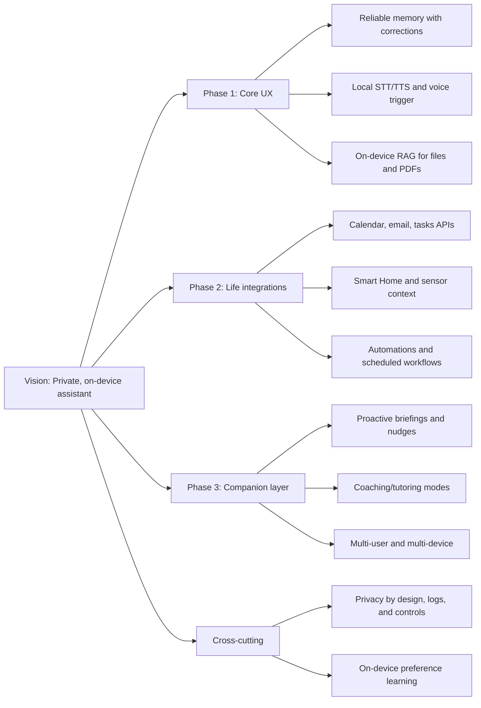

Here’s a distilled view of what people are actually asking for, based on discussions on Reddit (r/LocalLLaMA, r/LocalLLM, r/selfhosted, r/homeassistant, r/googleplay), Home Assistant forums, and open‑source/community posts.

Quick meta-answer: users don’t want “just a chatterbot.” They want a private, local “Jarvis” that can do real work across their life — especially if it’s truly offline and controllable. A single “killer feature” keeps coming up: long‑term memory that actually works and can be corrected, which is why “Reliable long‑term memory (with corrections)” is #1.

Top 10 ideas people want (in rough priority order from community signals)
1) Reliable long‑term memory (with corrections)
2) Local, private tool use & automation (calendar, email, tasks, APIs)
3) Always‑ready voice (wake word, VAD, STT/TTS on‑device)
4) Private “morning briefings” & proactive nudges
5) Personal knowledge assistant over local files (offline RAG)
6) Smart home & environment awareness (Home Assistant, sensors)
7) Background processing (transcripts, call/meeting summaries)
8) Companion / coach persona (tutor, accountability, reflection)
9) Multi‑user & multi‑device, with user recognition
10) Local‑only analytics & preference learning

Below: what each means + community proof points.

1) Reliable long‑term memory (with corrections)
- What people want: the assistant remembers facts and preferences, supports “my name is now…,” “don’t do X,” and can forget or correct specific memories.
- Why: without it, you re‑explain your life every session. Memory + RAG is frequently cited as the main thing that makes an assistant feel “personal.”【turn1fetch0】【turn0search11】
- Signals:
  - A LocalLLaMA poll’s top “first feature” is “Remember things reliably and accept corrections (‘my name is now…’).”【turn6fetch3】
  - Local‑assistant demos explicitly advertise long‑term memory and semantic search across files/emails/chats.【turn7fetch1】【turn7fetch2】

2) Local, private tool use & automation (calendar, email, tasks, APIs)
- What people want: hook into their real services (Calendar, Tasks, Notes, email) but without data leaving the device. Example rules: “If boss emails, reply in 10 min and add a task in Obsidian.”【turn1fetch0】
- Why: a standalone chatbot is “just a sounding board”; real utility comes from acting on your systems.【turn1fetch0】
- Signals:
  - Users explicitly call out interfacing with Google Tasks, Notes, Reminders, etc., as a goal.【turn1fetch0】
  - ADHD‑focused users built assistants that read email/calendar/tasks locally and manage time.【turn7fetch0】

3) Always‑ready voice (wake word, VAD, STT/TTS on‑device)
- What people want: push‑to‑talk or always‑listening; STT (Whisper.cpp) and TTS (Piper) locally; noise‑robust VAD (Silero) so it feels like a real appliance.【turn2fetch0】【turn11fetch1】
- Why: for hands‑free use while cooking, driving, or at a desk; privacy‑first voice assistant for everything is one of the most requested “Siri replacement” modes.【turn10fetch0】
- Signals:
  - Project Aura (local Android companion) is built around llama.cpp + Whisper.cpp + system voice trigger; comments repeatedly ask for true OS‑level wake word and background behavior.【turn2fetch0】
  - A Home Assistant project shows local wake word (openWakeWord), Silero VAD, Whisper for STT, and Piper TTS as the “appliance‑like” stack.【turn11fetch1】
  - A Tauri‑based voice assistant survey lists “General Siri replacement — local privacy‑first voice assistant for everything” as a candidate primary use case.【turn10fetch0】

4) Private “morning briefings” & proactive nudges
- What people want: auto‑generated daily digests (calendar, tasks, weather, habits); proactive nudges like “You have back‑to‑back meetings today — block focus time?”
- Why: this is the difference between reactive chatbot and “life OS.” Users building “Jarvis” systems specifically mention morning briefings as a headline feature.【turn7fetch1】
- Signals:
  - Atlantis (local desktop+mobile) explicitly offers “morning briefings” with calendar, email, tasks, and health data — all on‑device.【turn7fetch1】
  - Home Assistant + local LLM users run daily automations that summarize weather into actionable, natural‑language clothing/task recommendations and even set reminders.【turn16find0】

5) Personal knowledge assistant over local files (offline RAG)
- What people want: ingest PDFs, notes, codebases, bookmarks; answer questions from them; summarize and cross‑link — fully offline.【turn0search12】
- Why: users accumulate scattered notes/docs and want semantic search and project‑aware context without uploading everything to the cloud.【turn13fetch0】
- Signals:
  - Elastic’s Local RAG “personal knowledge assistant” demo targets exactly this: local embeddings + LLM over your files with no cloud.【turn0search12】
  - A local‑first assistant proposal highlights semantic indexing of local folders, cross‑linking notes/docs, and project‑aware continuity as core goals.【turn13fetch0】
  - EdgeDox (mobile) focuses on “Chat with PDFs, summarize, search” offline and asks users what other offline‑AI features they want; comments often ask for multi‑doc knowledge bases and offline voice input as next priorities.【turn10fetch1】

6) Smart home & environment awareness (Home Assistant, sensors)
- What people want: control devices with natural language; context from sensors (time, weather, presence); run automations through the assistant; keep everything local.【turn15fetch0】【turn14fetch0】
- Why: people are actively replacing Google/Alexa with local stacks and immediately ask for richer “if this then that” reasoning via the LLM.【turn15fetch0】【turn14fetch0】
- Signals:
  - XDA shows Home Assistant + local LLM enabling voice control with contextual awareness (time, weather, presence, previous commands) and chained commands in natural language.【turn16find1】
  - A local smart‑home voice‑assistant build explicitly aims for “more than ‘turn on the lights’” and extensibility to add capabilities over time.【turn14fetch0】

7) Background processing (transcripts, call/meeting summaries)
- What people want: record meetings/lectures; produce local transcripts, action items, and summaries — zero cloud uploads.
- Why: professionals and journalists care about privacy and offline operation; there’s a perceived gap for fully local transcription + assistant features.【turn12fetch0】
- Signals:
  - An r/LocalLLM post proposes an offline transcription + assistant that extracts action items and answers questions immediately from audio; comments confirm interest in meeting summaries and task extraction.【turn12fetch0】

8) Companion / coach persona (tutor, accountability, reflection)
- What people want: language practice, tutoring, coaching, and reflective “daily check‑ins”; small models (7B–9B) are considered sufficient for companionship on moderate GPUs.【turn10fetch0】
- Why: beyond productivity, people value an assistant that’s fun to talk to and helps them learn or stick to habits.
- Signals:
  - A local voice assistant dev explicitly lists “Language practice — practice speaking with a local AI tutor” as a top direction and asks users which use case they’d actually use daily.【turn10fetch0】
  - General “Jarvis” builds often emphasize personality (e.g., “sassy/sarcastic” voice) and companion‑style chat as part of the vision.【turn14fetch0】

9) Multi‑user & multi‑device, with user recognition
- What people want: per‑user profiles; device‑handoff between phone/desktop/speaker; optional voice or session‑based recognition so “my” assistant knows it’s me.
- Why: households share devices; devs want to unify assistant state across phone and PC; Home Assistant users explicitly ask for per‑user Assist behavior.【turn11fetch0】
- Signals:
  - Home Assistant feature requests for “Personalized Assist” (different behavior per user) and multi‑user assistants show strong interest and discussion of how to do this locally (voice‑print vs. session).【turn11fetch0】
  - A LocalLLaMA wishlist includes multi‑user support with separate permissions and preference profiles.【turn1fetch0】

10) Local‑only analytics & preference learning
- What people want: the assistant gets better over time at your tasks (e.g., email triage, formatting preferences), but all learning stays on‑device and is auditable.
- Why: a common complaint is that assistants don’t adapt; users explicitly ask for the ability to “learn” and improve, tied to local control and privacy.【turn1fetch0】
- Signals:
  - Local‑assistant wishlists call out “ability to learn, to get better at doing the kind of tasks set for it,” alongside memory and multi‑user features.【turn1fetch0】
  - LocalRAG/assistant guides emphasize on‑device logs/indices and user‑controlled model customization as part of the local‑first value proposition.【turn0search12】

How people talk about “the product” in one line
From r/LocalLLaMA, r/LocalLLM, and Home Assistant, the recurring ideal is: “A private, always‑available brain that remembers my life, can act on my apps and devices via voice, and works offline.”

Putting it into a roadmap view
This is how community wishes cluster into a practical build order:

If you’re building a Gemini/Siri‑like local assistant, the “minimum viable wow” from community signals looks like: long‑term memory + local voice + local file RAG + at least one integration (calendar/tasks or smart home) — with everything staying on‑device. That’s already enough to differentiate from most existing “offline chatbots.”【turn6fetch3】【turn10fetch0】【turn16find1】